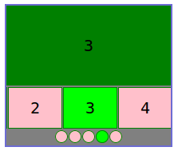

# three-thumbs-carousel

[![Build Status][travis-image]][travis-url]
[![Dependency Status][depstat-image]][depstat-url]
[![DevDependency Status][depstat-dev-image]][depstat-dev-url]

## Development



### Block structure
```jade
.carousel.js-carousel
    .carousel__image.js-carousel__image
    .carousel__thumbs.js-carousel__thumbs
        span.carousel__item.js-carousel__item
            a.carousel__thumb.js-carousel__thumb(href="foo-big.jpg")
                img.carousel__preview(src="foo-min.jpg")
    .carousel__dots.js-carousel__dots
        span.carousel__dot.js-carousel__dot
```

### Initialize
```sh
npm i
```

### Test
*In console*
```sh
npm run test
```

*In browser*
```sh
open ./text/index-test.html
```

### Lint
```sh
npm run lint
```

## License
MIT © [Vladimir Rodkin](https://github.com/VovanR)

[travis-url]: https://travis-ci.org/VovanR/three-thumbs-carousel
[travis-image]: http://img.shields.io/travis/VovanR/three-thumbs-carousel.svg

[depstat-url]: https://david-dm.org/VovanR/three-thumbs-carousel
[depstat-image]: https://david-dm.org/VovanR/three-thumbs-carousel.svg

[depstat-dev-url]: https://david-dm.org/VovanR/three-thumbs-carousel
[depstat-dev-image]: https://david-dm.org/VovanR/three-thumbs-carousel/dev-status.svg
